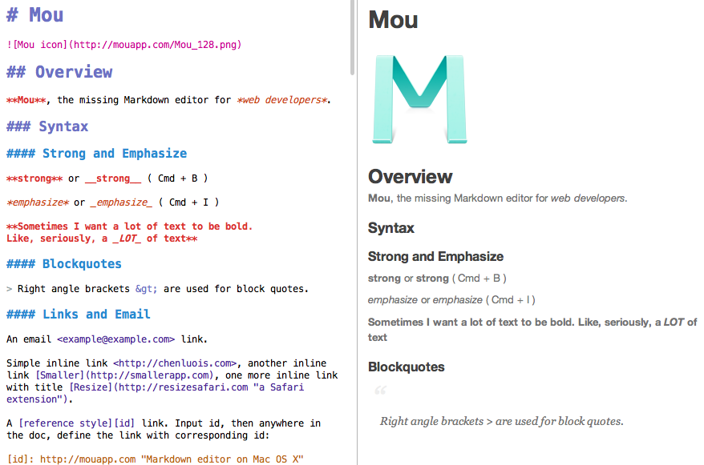
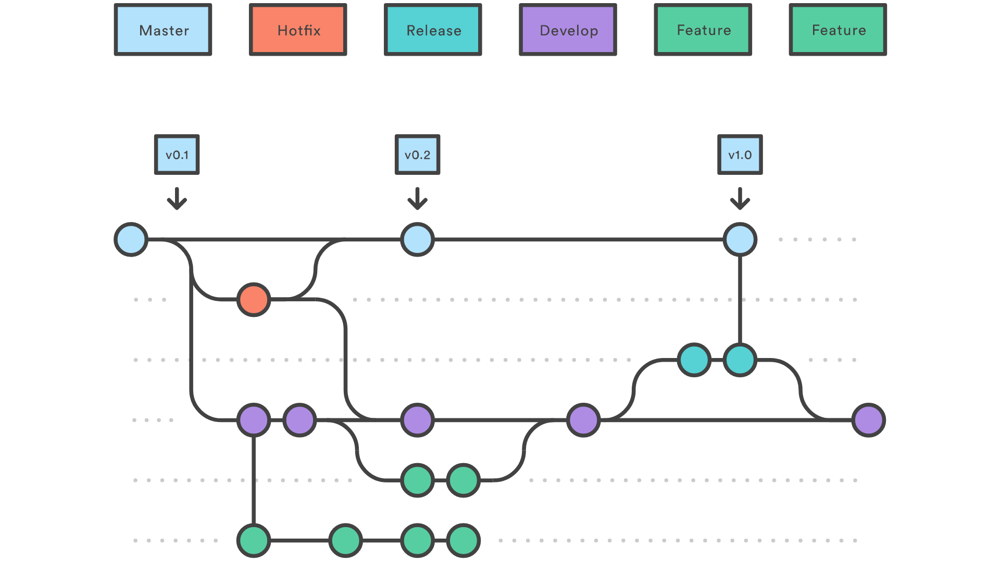

# Doc as code
- markdown
- git
- git flow
- build

---

# Markdown
- text &rarr; html
- lightweight markup language
- flavors
----
# .md example

Note: https://medium.com/@taylorhxu/markdown-for-dummies-a24e982b8e85
---

# Git
- tracks changes
  - atomic
- text
----
# Git detail
- feature branches
- team
- distributed VCS
---
# Git flow

Note: https://www.atlassian.com/git/tutorials/comparing-workflows/gitflow-workflow
----
# Git pull request

Note: https://crunchify.com/how-to-fork-github-repository-create-pull-request-and-merge/
---
# Learning Git
- online: https://www.atlassian.com/git/tutorials
- book: https://git-scm.com/book/en/v2
- youtube
  - https://www.youtube.com/channel/UCP7RrmoueENv9TZts3HXXtw
- courses
  - https://www.lynda.com/search?q=git
  - https://www.coursera.org/learn/version-control-with-git
  - https://www.udemy.com/courses/search/?ref=home&src=ukw&q=git
---
# Git tools
- command line
- GUI - GitKraken
- GUI plugins
  - Visual Studio Code
  - Atom
  - Intellij Idea
---
# Build
- html, pdf
- docker, pandoc

# Build details
- git hook
- jenkins, trevis-ci, circle-ci
- deployment to S3, ...
