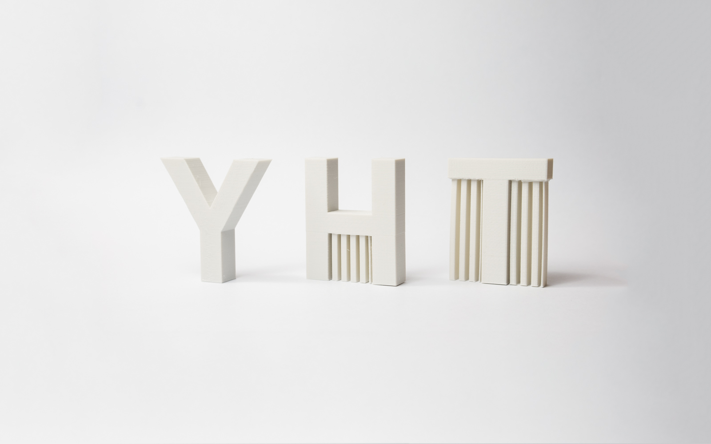

## 3D printing at home

 <!-- .element width="28.5%" -->
 <!-- .element width="30%" -->
 <!-- .element width="30.5%" -->

---
## 3d print series
1. **printing at home**
1. modeling
1. print technologies
---
## 3D print = 2d print in layers
<video  src="3d-home/teleport-animation.webm" controls data-autoplay loop></video>
---
## Technology tree

----
## Technology tree FDM
 <!-- .element width="15%" -->
...................
 <!-- .element width="15%" -->

---
## History

SLA-1, the first 3D printer

invented by Chuck Hull in 1983

<!--
link: https://www.sculpteo.com/blog/2016/12/14/the-history-of-3d-printing-3d-printing-technologies-from-the-80s-to-today/
FIND: timeline
- https://www.google.cz/search?q=3d+printing+history+timeline&oq=3d+print+history+timelin&aqs=chrome.1.69i57j0j69i64l2.9015j0j7&sourceid=chrome&ie=UTF-8
- https://www.google.cz/search?q=3d+printing+history+timeline&source=lnms&tbm=isch&sa=X&ved=0ahUKEwi36Zj4ps7aAhUGDuwKHRKuC08Q_AUICigB&biw=1855&bih=1110
-->
----

- 1980: first patent by japanese Dr Kodama Rapid prototyping
- 1984: Stereolithography by french then abandoned
- 1986: Stereolithography taken up by Charles Hull
- 1987: First SLA-1 machine
- 1990: First EOS Stereos system
- **1992: FDM patent to Stratasys**
----
- 2006: An open source project is initiated (Reprap)
- 2009: FDM patents in the public domain
- 2009: MakerBot was founded
- 2011: Cornell University began to build 3D food printer.
- 2013: “3D printing” in Obama’s State of the Union speech
- 2015: Carbon 3D issues their revolutionary ultra-fast CLIP 3D printing machine

---
## FDM schematic

----
## Detail
Material Extrusion

 <!-- .element width="70%" -->

---
## Models
  <!-- .element width="20%" -->
  <!-- .element width="20%" -->
  <!-- .element width="20%" -->
  <!-- .element width="20%" -->
  <!-- .element width="20%" -->
  <!-- .element width="20%" -->
  <!-- .element width="20%" -->
  <!-- .element width="20%" -->

----
## Model download
- thingiverse
- yourmagine
- github

----
## Modeling
- separate presentation

---
## Slicer
Slicer = print planner

 <!-- .element width="70%" -->

----
Stl &nbsp;&nbsp;&nbsp;&nbsp;&nbsp;&nbsp;&nbsp;&nbsp;&nbsp;&nbsp;&nbsp;&nbsp;&nbsp;&nbsp;&nbsp;&nbsp;&nbsp;&nbsp;&nbsp;&nbsp;&nbsp;&nbsp;&nbsp;&nbsp;&nbsp;&nbsp;&nbsp; GCode

 <!-- .element width="32%" -->
 <!-- .element width="32%" -->

----
## Slicer settings
- material temperature, design
- layer height smaller = longer
- speed higher speed = lower quality
- print profiles

----
## Slicer settings example
 <!-- .element width="40%" -->
 <!-- .element width="40%" -->

----
## Slicers

Slic3r &nbsp;&nbsp;&nbsp;&nbsp;&nbsp;&nbsp;&nbsp;&nbsp;&nbsp; Slic3r PE &nbsp;&nbsp;&nbsp;&nbsp;&nbsp;&nbsp;&nbsp;&nbsp;&nbsp; Cura &nbsp;&nbsp;&nbsp;&nbsp;&nbsp;&nbsp;&nbsp;&nbsp; Simplify3D

  <!-- .element width="20%" -->
 <!-- .element width="20%" -->
 <!-- .element width="20%" -->
 <!-- .element width="20%" -->

---
## Materials

 <!-- .element width="80%" -->

----
## Material properties

 <!-- .element width="45%" -->

----
## Material basics

- PLA
- ABS
- Nylon
   - (moisture)
- PET
- PETG
- ASA
- Carbon fiber

Note: https://www.simplify3d.com/support/materials-guide/   https://blog.tinkercad.com/materialsguide/

----
## Flexible
- TPE, TPU
- 98A, 92A

 <!-- .element width="40%" -->
 <!-- .element width="42%" -->

----
## Supports
- PVA
- HIPS
- (multimaterial printer required)

 <!-- .element width="40%" -->
 <!-- .element width="40%" -->

----
## Mixture - wood

 <!-- .element width="60%" -->

----
## Mixture - metal
- metal: brass, copper, iron
- (weight)

 <!-- .element width="45%" -->
 <!-- .element width="40%" -->

----
## Special
- color changing
- fire retardant

 <!-- .element width="40%" -->
 <!-- .element width="42.5%" -->

----
## Special
- glow in the dark

 <!-- .element width="40%" -->

----
## Filament maker
 <!-- .element width="40%" -->
 <!-- .element width="40%" -->

---
## Usage
- projects
- home things
- design

---
## Print - overhangs/supports
 <!-- .element width="38%" -->
 <!-- .element width="57%" -->

----
## Print issues
 <!-- .element width="20%" -->
 <!-- .element width="20%" -->
 <!-- .element width="20%" -->
 <!-- .element width="20%" -->
 <!-- .element width="20%" -->
 <!-- .element width="20%" -->
 <!-- .element width="20%" -->
 <!-- .element width="20%" -->

---
## Parts

- Type
- Frame
- Electronics
- Extruder
- bed
- auto bed leveling

----
## Type: Cartersian

 <!-- .element width="40%" -->
 <!-- .element width="40%" -->

----
## Type: Delta

 <!-- .element width="40%" -->

----
## Electronics
RAMPS  Rambo Einsy  Duet

 <!-- .element width="30%" -->
 <!-- .element width="30%" -->
 <!-- .element width="30%" -->

----
## Firmware
Marlin

 <!-- .element width="30%" -->
 <!-- .element width="60%" -->

----
## Extruder

 <!-- .element width="40%" -->
 <!-- .element width="40%" -->

----
## Hot end
 <!-- .element width="40%" -->
 <!-- .element width="40%" -->

----
## Nozzle

Hole: 0.15-1.2mm

- brass
- copper

- ruby
- hardened steel
- stainless

---
## 3d pen
 <!-- .element width="40%" -->
 <!-- .element width="40%" -->
---
## Companies in 3d printing
Open source:
- Prusa
- Lutzbot
- BCN3D
- Ultimaker

Commercial:
- Stratasys
- 3D Systems
---
## What to buy - Prusa i3 MK3
 <!-- .element width="40%" -->
 <!-- .element width="40%" -->

speed, low noise, bed leveling, upgrade kits,
magnetic heatbed with replaceable PEI spring steel, ...

----
## China
Creativity CR-10  Anet A8

 <!-- .element width="40%" -->
 <!-- .element width="40%" -->

----
- https://www.3dhubs.com/best-3d-printer-guide
- https://all3dp.com/1/best-3d-printer-reviews-top-3d-printers-home-3-d-printer-3d/
- Prusa, ...
- Not CRS-10, Tivo Tarrantula, ...

---
## Links
- https://www.3dhubs.com/what-is-3d-printing
- https://www.3dhubs.com/knowledge-base
